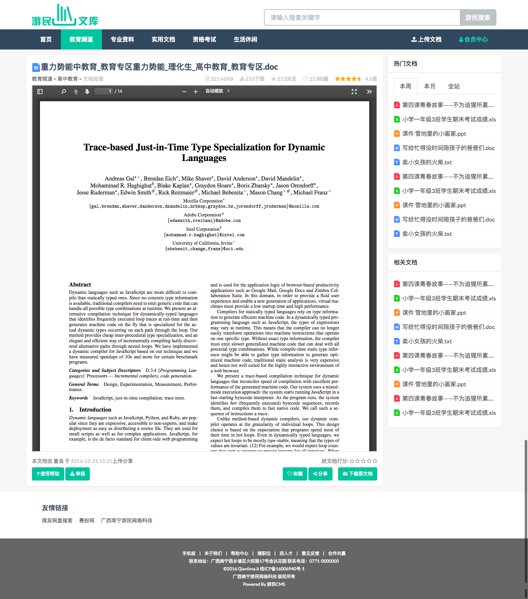
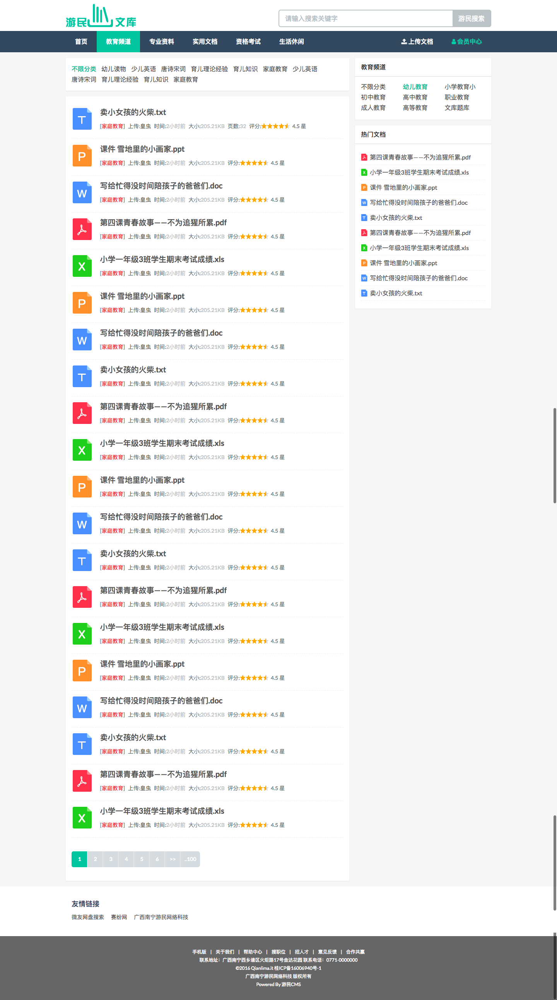

# DocHub文库PC端模板

[DocHub](https://gitee.com/TruthHun/DocHub)文库PC端模板，使用基于Bootstrap的Flat-UI开发，模板页面是在2016年8月份左右开发出来的，原型我也不记得是参考哪个站点的了，毕竟这个PC端模板差不多算是两年前的作品了。

`DocHub`演示站点[IT文库(http://wenku.it)](http://wenku.it)上的页面，在开发的时候，对样式和页面布局做了一些改动，而且，现在的模板，是没有实现一些js相关功能的。

现以Apache 2.0 开源协议，将模板开源出来，有需要的朋友可以直接拿来使用。

## 模板托管地址

- GitHub：https://github.com/TruthHun/DocHubTemplate4PC
- Gitee：https://gitee.com/TruthHun/DocHubTemplate4PC

## DocHub文库程序源码地址

- GitHub：https://github.com/TruthHun/DocHub
- Gitee： https://gitee.com/TruthHun/DocHub

## QQ交流群
为方便相互学习和交流，建了个QQ群，加群请备注`来自DocHub`

> QQ交流群：457803862(猿军团)

同时要说明的是，这个是学习交流群，如果是程序相关问题，请提交issue，再把issue链接发群里。

## 说明

模板页面的footer上的`广西南宁游民网络科技`是我之前回南宁和朋友"创业"时候注册的公司，后来混不下去，把公司注销然后跑深圳来了。
别看这那个`XX版权所有`，这个没关系的，开源出来，大家在使用的时候，想怎么改就怎么改。

## 模板页面一览

> 首页

-----

> 文档阅读页

-----

> 文档列表页

-----

> 搜索结果

